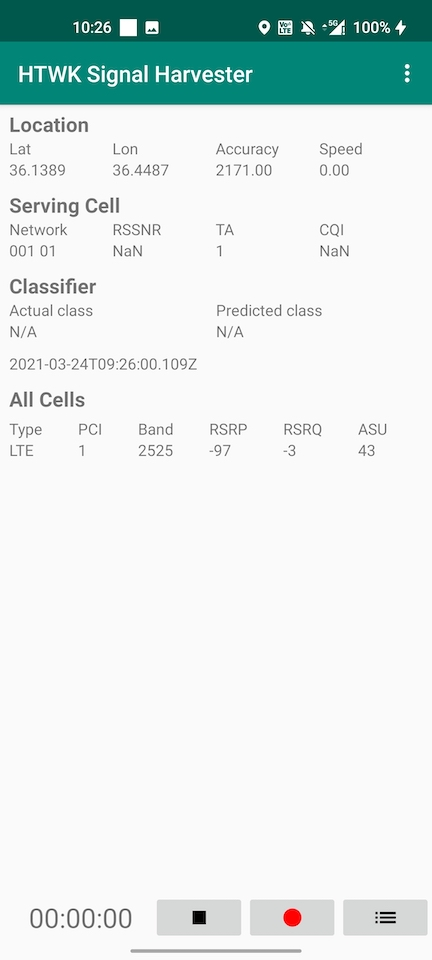
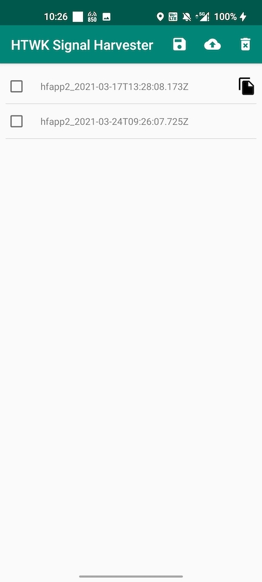
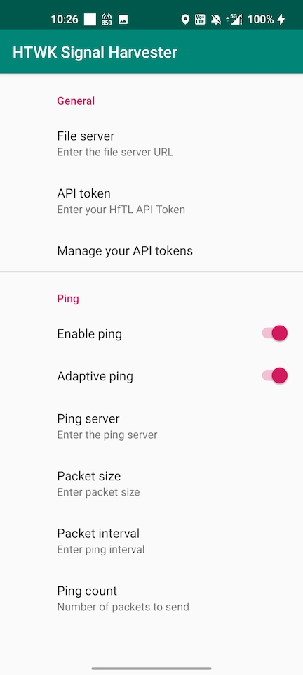

# HTWK Signal Harvester

Android application for LTE/5G NR measurements using Android API. Application collects [cell information](https://developer.android.com/reference/android/telephony/CellInfo), [cell signal strength](https://developer.android.com/reference/android/telephony/CellSignalStrength) along with location information from GPS.

Application has integrated ICMP ping, it supports export of results to CSV.

Main view:

Settings view:

Export view:

## Copyright
Developer: Igor Kim

THE SOFTWARE IS PROVIDED "AS IS", WITHOUT WARRANTY OF ANY KIND, EXPRESS OR IMPLIED, INCLUDING BUT NOT LIMITED TO THE WARRANTIES OF MERCHANTABILITY, FITNESS FOR A PARTICULAR PURPOSE AND NONINFRINGEMENT. IN NO EVENT SHALL THE AUTHORS OR COPYRIGHT HOLDERS BE LIABLE FOR ANY CLAIM, DAMAGES OR OTHER LIABILITY, WHETHER IN AN ACTION OF CONTRACT, TORT OR OTHERWISE, ARISING FROM, OUT OF OR IN CONNECTION WITH THE SOFTWARE OR THE USE OR OTHER DEALINGS IN THE SOFTWARE.
